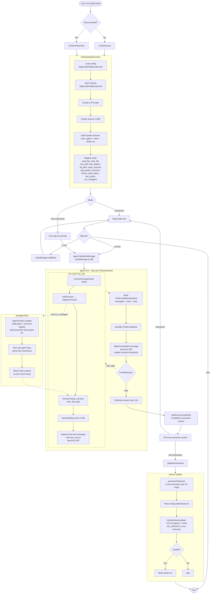

# babyCoder Agent Loop

End-to-end flow of a prompt through babyCoder: initialization, the agent loop,
tool execution, sub-agents, and the post-session dream/memory update.

## Flow Diagram

## Key Points

- **Single loop** in `agent.Run` (`internal/services/agent/agent.go:130`):
  request &rarr; LLM &rarr; if `tool_calls`, execute all, append results, repeat;
  if `stop`, exit.
- **Persistence** happens at every step (assistant message, tool execution,
  tool response message) via `storage.Database`.
- **Sub-agents** are spawned through the `run_subagent` tool using
  `AgentFactory` (`main.go:171`), which builds a child `Agent` sharing
  provider/db but with its own session row and tool registry.
- **Dream memory** runs post-session (`internal/services/agent/dream.go:15`)
  via two LLM calls (summarize + decide-update) and persists to
  `.babycoder/dream.txt`, which is injected into the next session's system
  prompt.
